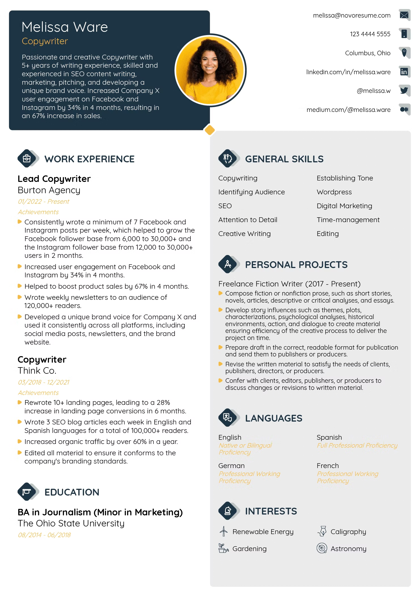

# 🚀 AI Resume Analyzer

<div align="center">


**Smart AI-Powered Resume Analysis & ATS Score Optimization**

[](https://typescriptlang.org/)
[](https://reactjs.org/)
[](https://vitejs.dev/)
[](https://tailwindcss.com/)
[](https://docker.com/)

[🌟 Features](#-features) • [🚀 Quick Start](#-quick-start) • [📸 Screenshots](#-screenshots) • [🛠️ Tech Stack](#️-tech-stack) • [📖 Documentation](#-documentation)

</div>

---

## 🎯 About

**AI Resume Analyzer** is a cutting-edge web application that leverages artificial intelligence to provide comprehensive resume analysis and optimization suggestions. Get instant feedback on your resume's ATS compatibility, structure, content quality, and receive actionable insights to land your dream job!

### 🌟 Key Highlights

- 📊 **ATS Score Analysis** - Real-time Applicant Tracking System compatibility scoring
- 🎨 **Visual Resume Preview** - Interactive resume visualization with image rendering
- 💡 **AI-Powered Feedback** - Intelligent suggestions for content, tone, and structure
- 📈 **Performance Tracking** - Monitor your application progress and improvements
- 🔒 **Secure Storage** - Safe and private resume handling with Puter.js integration
- � **Responsive Design** - Beautiful UI that works on all devices

---

## ✨ Features

<table>
<tr>
<td width="50%">

### 🤖 AI Analysis Engine

- **Overall Score**: Comprehensive resume rating (0-100)
- **ATS Compatibility**: Keyword optimization analysis
- **Content Quality**: Writing style and relevance assessment
- **Structure Analysis**: Layout and formatting evaluation
- **Tone & Style**: Professional communication review
- **Skills Matching**: Technical and soft skills alignment

</td>
<td width="50%">

### 🎨 User Experience

- **Drag & Drop Upload**: Intuitive file upload interface
- **Real-time Preview**: Instant resume visualization
- **Interactive Dashboard**: Clean, modern interface
- **Progress Tracking**: Monitor multiple resume versions
- **Export Options**: Download optimized resumes
- **Mobile Responsive**: Works perfectly on all devices

</td>
</tr>
</table>

---

## � Quick Start

### Prerequisites

Make sure you have the following installed:

-  **Node.js 18+**
-  **npm** or **yarn**
-  **Git**

### 🔧 Installation

```bash
# Clone the repository
git clone https://github.com/YashVarpe05/AI-Resume-Analyzer.git

# Navigate to project directory
cd AI-Resume-Analyzer

# Install dependencies
npm install

# Start development server
npm run dev
```

🎉 **That's it!** Open [http://localhost:5173](http://localhost:5173) to see your application.

---

## 📸 Screenshots

<div align="center">

### 🏠 Home Dashboard


_Track your applications and view ATS scores at a glance_

### 📊 Resume Analysis


_Comprehensive AI-powered feedback and suggestions_

### 📤 Upload Interface


_Intuitive drag-and-drop resume upload_

</div>

---

## 🛠️ Tech Stack

<div align="center">

| Category        | Technologies                                                                                                                                                                                                                                                                |
| --------------- | --------------------------------------------------------------------------------------------------------------------------------------------------------------------------------------------------------------------------------------------------------------------------- |
| **Frontend**    |    |
| **Styling**     |                                                                                                 |
| **Build Tools** |                                                                                                                 |
| **Storage**     |                                                                                                                                                                                           |
| **Deployment**  |                                                                                                                                                                                   |

</div>

---

## 📁 Project Structure

```
AI-Resume-Analyzer/
├── 📁 app/
│   ├── 📁 components/          # Reusable UI components
│   │   ├── 🧩 ResumeCard.tsx   # Resume display card
│   │   ├── 📊 ScoreCircle.tsx  # Score visualization
│   │   ├── 📤 FileUploader.tsx # File upload component
│   │   └── 🎯 ATS.tsx          # ATS analysis display
│   ├── 📁 routes/              # Application routes
│   │   ├── 🏠 home.tsx         # Dashboard page
│   │   ├── 📄 resume.tsx       # Resume detail view
│   │   └── 📤 upload.tsx       # Upload interface
│   └── 📁 lib/                 # Utility libraries
│       ├── 🗄️ puter.ts         # Puter.js integration
│       └── 🔧 utils.ts         # Helper functions
├── 📁 constants/               # App constants
├── 📁 types/                   # TypeScript definitions
├── 📁 public/                  # Static assets
│   └── 📁 images/              # UI images and icons
└── 📄 README.md               # You are here! 👋
```

---

## 🎨 Customization

### 🎭 Themes & Styling

- **TailwindCSS**: Fully customizable design system
- **CSS Variables**: Easy color scheme modifications
- **Responsive Design**: Mobile-first approach
- **Dark Mode Ready**: Prepared for theme switching

### 🔧 Configuration

- **Environment Variables**: Easy deployment configuration
- **API Integration**: Ready for backend services
- **Storage Options**: Flexible file storage solutions

---

## 🚀 Deployment

### 🐳 Docker Deployment

```bash
# Build Docker image
docker build -t ai-resume-analyzer .

# Run container
docker run -p 3000:3000 ai-resume-analyzer
```

### ☁️ Cloud Platforms

Deploy to your favorite platform:

| Platform    | Status   | Guide                                    |
| ----------- | -------- | ---------------------------------------- |
| **Vercel**  | ✅ Ready | [Deploy Guide](https://vercel.com/docs)  |
| **Netlify** | ✅ Ready | [Deploy Guide](https://docs.netlify.com) |
| **Railway** | ✅ Ready | [Deploy Guide](https://docs.railway.app) |
| **Docker**  | ✅ Ready | See above                                |

---

## 📖 Documentation

### 🎯 How It Works

1. **📤 Upload**: Drag and drop your resume (PDF/DOCX)
2. **🤖 Analysis**: AI processes your resume content
3. **📊 Scoring**: Get comprehensive ATS and quality scores
4. **💡 Feedback**: Receive actionable improvement suggestions
5. **📈 Track**: Monitor your progress across applications

### 🔧 Development

```bash
# Available scripts
npm run dev        # Start development server
npm run build      # Build for production
npm run preview    # Preview production build
npm run lint       # Run ESLint
npm run type-check # TypeScript validation
```

---

## 🤝 Contributing

We welcome contributions! Here's how you can help:

1. 🍴 **Fork** the repository
2. 🌿 **Create** a feature branch (`git checkout -b feature/amazing-feature`)
3. ✅ **Commit** your changes (`git commit -m 'Add amazing feature'`)
4. 📤 **Push** to the branch (`git push origin feature/amazing-feature`)
5. 🔄 **Open** a Pull Request

---

## 📜 License

This project is licensed under the **MIT License** - see the [LICENSE](LICENSE) file for details.

---

## 🙏 Acknowledgments

- 🎨 **UI/UX Design**: Inspired by modern design principles
- 🤖 **AI Integration**: Powered by advanced NLP algorithms
- 📊 **Data Visualization**: Beautiful charts and metrics
- 🔒 **Security**: Privacy-first approach

---

<div align="center">

### 🌟 Star this project if you found it helpful!

**Made with ❤️ by [Yash Varpe](https://github.com/YashVarpe05)**

[](https://github.com/YashVarpe05/AI-Resume-Analyzer/stargazers)
[](https://github.com/YashVarpe05/AI-Resume-Analyzer/network/members)

</div>
